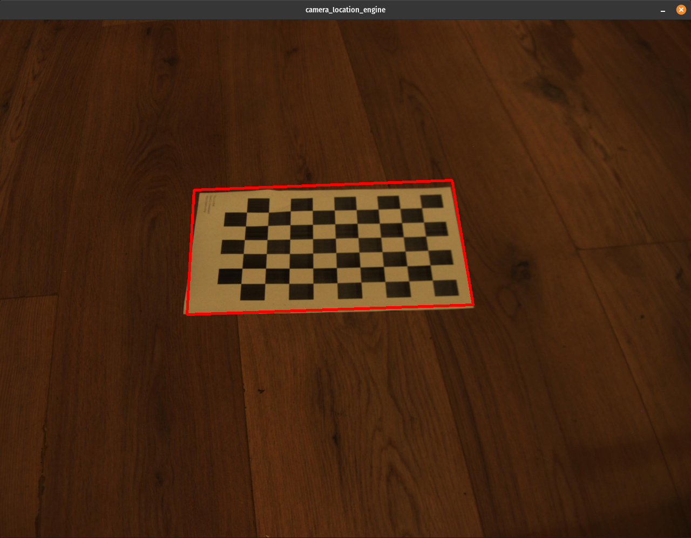
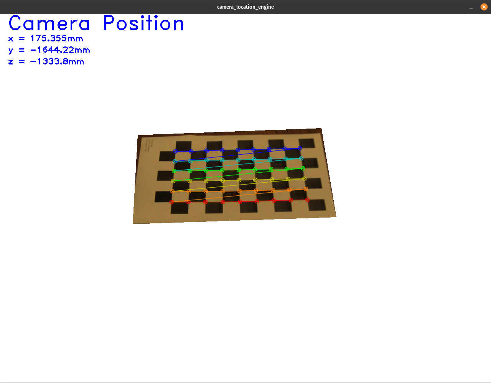
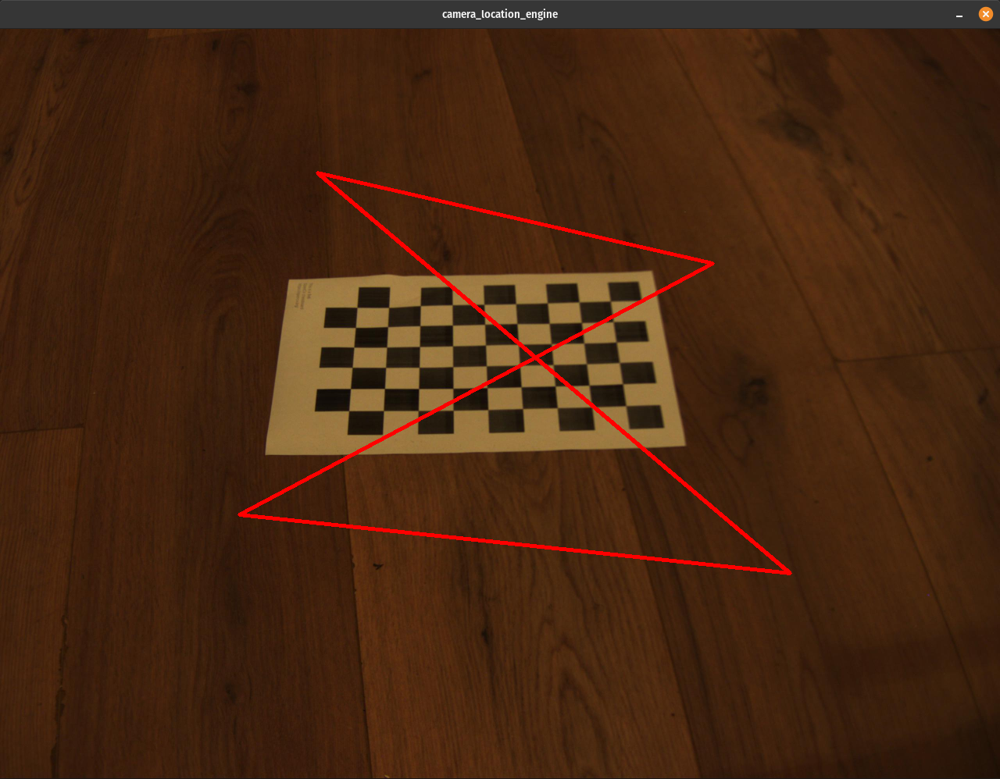
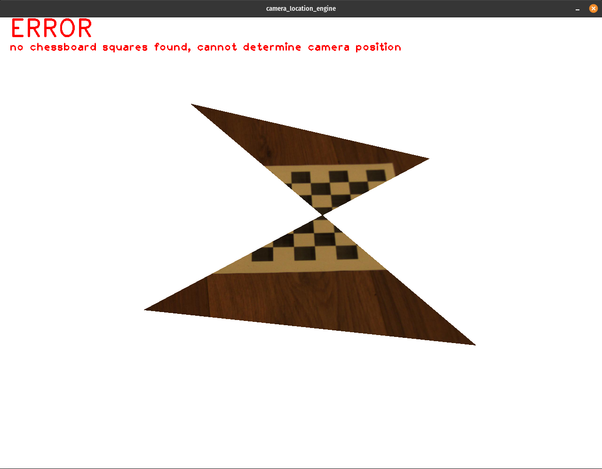

# Camera Location System

## Specs

* Linux distro "Pop!_OS 21.10"
* cmake version 3.18.4
* The CXX compiler identification is GNU 11.2.0
* opencv 4.5.3

## Description

This system is capable of determining the location of a camera based on a photo of a chessboard pattern taken by the camera.

There are 2 projects in this system.

* camera-location-engine: builds executable camera_location_engine which is an Interactive UI using opencv
* camera-location-test: builds executable camera_location_test which is a unit test program using google test

## Build & Run

You can build & run both projects with the single script pipeline.sh.

## Using the Interactive UI

* Left-mouse button: select corners
* Enter key (CR): run location determination
* Backspace key (BS): erase selected corners and any camera position results
* Escape key (ESC): exit the UI

### Successful Camera Location

Use the left-mouse button to click on 4 corners in the order you would walk them.

When you click the 4th corner, red lines will be drawn connecting the corners.

If you selected the corners in the correct order, the red shape you see will be a box.

Press CR on the keyboard to run the routine that determines the camera position.

Press BS or simply click on another point to try again.

Press ESC to exit.

### Unsuccessful Camera Location

The corners you selected may not create a red box that has sufficient chessboard squares inside of it.

In which case the location determination routine will not find the camera position.

### Output Logging

When you run the UI using the run.sh script it will automatically redirect program stdout to the io/output/output.txt file.

You will also find a sample version of this output file there.

[Sample Output](camera-location-engine/io/output/output_sample.txt)
